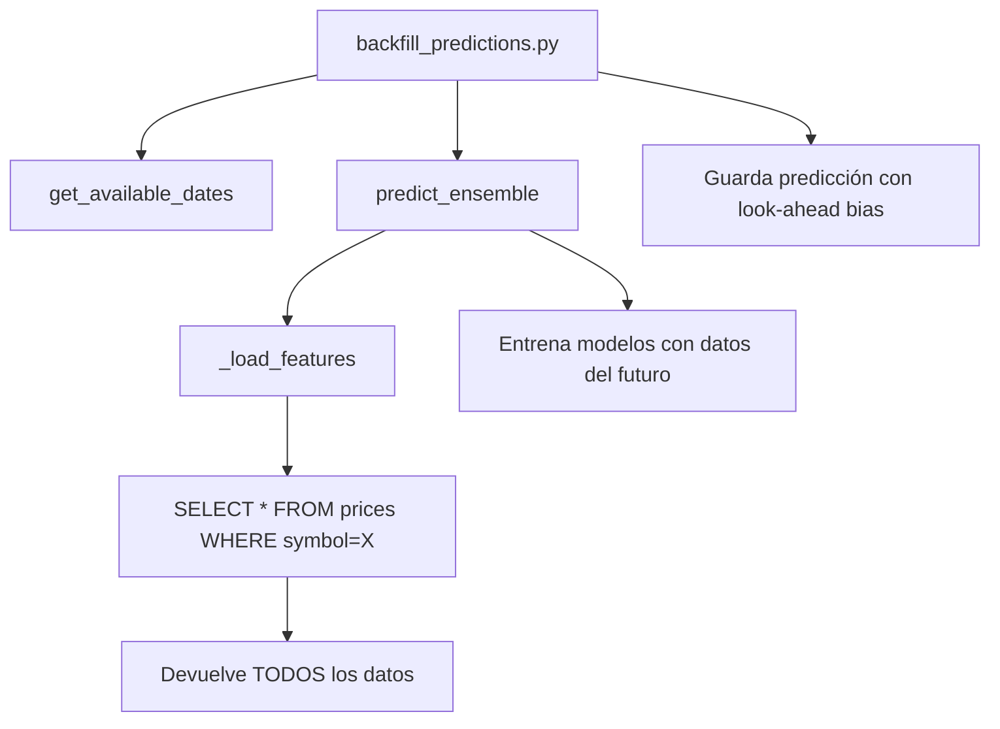
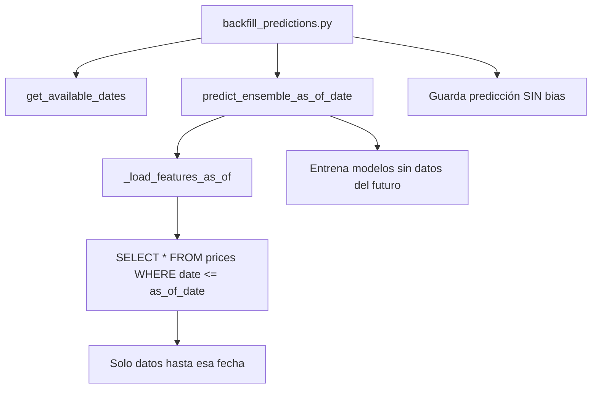

# 📊 Backfill de Predicciones - Guía y Problemas

## ❌ Por qué NO funciona actualmente

### 1. **Look-Ahead Bias (Problema Principal)**

El script `backfill_predictions.py` tiene un **fallo fundamental de diseño**:

```python
# Para cada fecha histórica D:
for d in dates:
    prediction_date = d
    result = predict_ensemble(symbol)  # ❌ USA TODOS LOS DATOS HASTA HOY
    save_predictions(...)
```

**Problema**: `predict_ensemble()` llama a `_load_features()` que carga **TODOS** los datos históricos sin filtrar por fecha. Esto significa que cuando "predecimos" el 1 de diciembre de 2024, estamos usando información de diciembre, enero, febrero... **del futuro**.

**Resultado**: Las predicciones históricas parecerán artificialmente buenas porque tienen información que no deberían tener.

### 2. **Error de Conexión (Problema Técnico)**

```bash
$ python3 mcp_server/scripts/backfill_predictions.py
❌ Error: could not translate host name "db" to address
```

**Causa**: El script intenta conectarse a `DB_HOST=db` (nombre del servicio Docker), pero si lo ejecutas fuera del contenedor, ese hostname no existe.

**Solución**: Ejecutar DENTRO del contenedor:
```bash
docker exec -it mcp_finance python -m scripts.backfill_predictions
```

O usar el script helper:
```bash
./run_backfill.sh
```

## 🔧 Cómo funciona actualmente



## ✅ Cómo DEBERÍA funcionar



## 🛠️ Solución Propuesta

### Opción 1: Refactorizar `_load_features()` (Recomendado)

```python
def _load_features(symbol: str, as_of_date: date = None) -> pd.DataFrame:
    """Carga features filtrando por fecha si se especifica."""
    conn = get_db_conn()
    try:
        with conn.cursor() as cur:
            if as_of_date:
                # Solo datos hasta as_of_date
                cur.execute("""
                    SELECT ...
                    FROM prices p
                    LEFT JOIN indicators i ...
                    WHERE p.symbol = %s AND p.date <= %s
                    ORDER BY p.date
                """, (symbol, as_of_date))
            else:
                # Comportamiento actual: todos los datos
                cur.execute("""
                    SELECT ...
                    FROM prices p
                    LEFT JOIN indicators i ...
                    WHERE p.symbol = %s
                    ORDER BY p.date
                """, (symbol,))
            rows = cur.fetchall()
    finally:
        if conn:
            conn.close()
    
    # ... resto del código igual
```

### Opción 2: Crear función separada para backfill

```python
def predict_ensemble_historical(symbol: str, as_of_date: date, force_retrain: bool = True) -> dict:
    """
    Versión especial de predict_ensemble que solo usa datos hasta as_of_date.
    
    Args:
        symbol: Símbolo del activo
        as_of_date: Fecha límite para los datos (simula predicción en tiempo real)
        force_retrain: Siempre True para backfill (no queremos modelos guardados)
    """
    df = _load_features(symbol, as_of_date=as_of_date)
    # ... resto igual a predict_ensemble pero sin cargar modelos guardados
```

### Opción 3: No usar backfill (Actual)

**Recomendación actual**: NO usar backfill para evaluar rendimiento histórico. En su lugar:

1. Ejecutar el sistema diariamente en producción
2. Las predicciones se guardan automáticamente con `save_daily_predictions()`
3. Validar con `/validate_predictions` al día siguiente
4. Usar `/model_performance` para analizar rendimiento real sin bias

## 📝 Uso del Script Actual (con sus limitaciones)

### Desde fuera del contenedor:
```bash
./run_backfill.sh
```

### Desde dentro del contenedor:
```bash
docker exec -it mcp_finance bash
cd /app
python -m scripts.backfill_predictions
```

### Modificar fechas:
Edita `backfill_predictions.py`:
```python
if __name__ == "__main__":
    symbol = "^IBEX"
    start = date(2024, 12, 1)  # Cambiar aquí
    end = date(2024, 12, 10)   # Cambiar aquí
    backfill_predictions_for_symbol(symbol, start_date=start, end_date=end)
```

## ⚠️ Advertencias

1. **NO uses este script para evaluar rendimiento de modelos** - los resultados serán engañosos
2. **Solo útil para**: llenar datos faltantes si el sistema estuvo caído algunos días
3. **Aún así tendrá bias**: porque los modelos se entrenan con datos del futuro
4. **Mejor alternativa**: Re-ejecutar todo el flujo diario manualmente para las fechas faltantes:
   ```bash
   curl "http://localhost:8082/update_prices?market=IBEX35"
   curl "http://localhost:8082/update_news?markets=IBEX35"
   curl "http://localhost:8082/compute_indicators?market=IBEX35"
   curl "http://localhost:8082/predecir_ensemble?symbol=^IBEX"
   ```

## 🎯 Próximos Pasos

Si necesitas backfill real sin bias:

1. Implementar `as_of_date` en `_load_features()`
2. Crear `predict_ensemble_historical()`
3. Actualizar `backfill_predictions.py` para usar la nueva función
4. Agregar tests para verificar que no hay datos del futuro
5. Documentar diferencias entre predicción en tiempo real vs histórica

## 📚 Recursos

- [Avoiding Look-Ahead Bias in Machine Learning](https://en.wikipedia.org/wiki/Look-ahead_bias)
- [Time Series Cross-Validation](https://scikit-learn.org/stable/modules/cross_validation.html#time-series-split)
- Documentación interna: `mcp_server/scripts/models.py`
